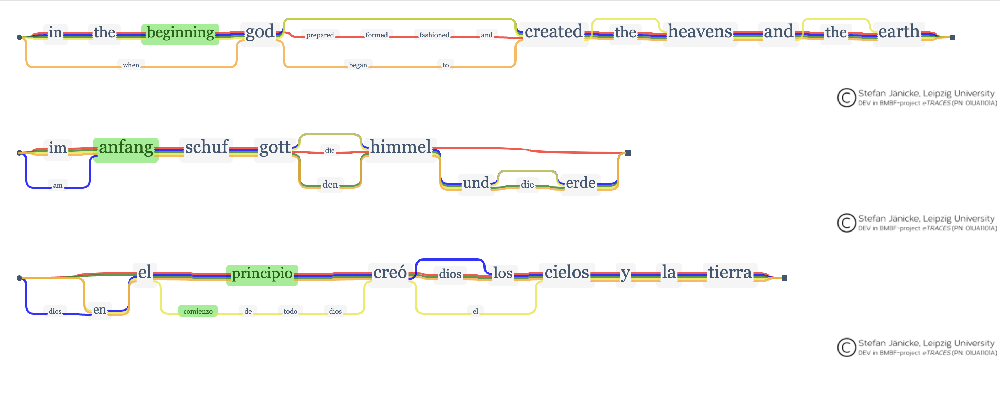

<a id="readme-top"></a>


<br />
<div align="center">
  <a href="https://github.com/RHO-DK/MTRAViz">
    
  </a>

  <h3 align="center">(M)TRAViz - Multilingual Close Reading Tool</h3>

  <p align="center">
    Modernizing a JavaScript source code!
    <br />
    <a href="https://github.com/RHO-DK/MTRAViz/tree/master/1MTRAVizDev"><strong>Explore»</strong></a>
    <br />
    <br />
    <a href="https://github.com/RHO-DK/MTRAViz/blob/master/introMTRAViz.gif">View Demo</a>
    ·
    <a href="https://github.com/RHO-DK/MTRAViz/issues">Inquiry</a>
  </p>
</div>


<!-- TABLE OF CONTENTS -->
<details>
  <summary>Table of Contents</summary>
  <ol>
    <li>
      <a href="#about">About</a>
      <ul>
        <li><a href="#build-with">Build With</a></li>
      </ul>
    </li>
    <li><a href="#getting-started">Getting Started</a></li>
    <li><a href="#usage">Usage</a></li>
          <ul>
        <li><a href="#data-structure">Data Structure</a></li>
        <li><a href="#languages">Languages</a></li>
      </ul>
    <li><a href="#development">Development</a></li>
    <li><a href="#colaborate">Collaborate</a></li>
    <li><a href="#the-original-work">The Original Work</a></li>
    <li><a href="#license">License</a></li>
    <li><a href="#contact">Contact</a></li>
    <li><a href="#readme-template">README Template</a></li>
  </ol>
</details>


<!-- ABOUT THE PROJECT -->
## About


(M)TRAViz is under development, it is a close reading tool for textual alignment across languages. Close reading is a research discipline practiced in the humanities where different editions of a text are xaligned and closely inspected for the purpose of comparison. It can used for interpreting cultural changes, differences in cultural embeddings affecting translations over time, or it can be used for close-up inspection in suspicion of plagiarism.

It is based entirely upon TRAViz by [Stefan Jänicke](#the-original-work). Alignments are visualized using directed variant graphs, see the image at the top of the README. 

### Interactions of the visualization include:

- Merge and split capabilities of vertices in the graph, thus allowing a different alignment, as the edition-paths are re-routed.
- Tooltips that display by user-interaction (mouseenter, -hover, -leave, -click), and render information relevant to the displayed graph contents.
- Highlight of synonym tokens across different languagebased graphs
- User defined configurations such as normalization of sentences in the data-file, linebreaks in the graph renderings, decisions on similarities of tokens, which interactions to activate, colorsettings etc.

This pilot includes a test data-set, thanks to [Zefania XML Bible Markup Language Files](https://sourceforge.net/projects/zefania-sharp/files/Bibles/) and hardcoded [dictionaries](#languages) thanks to [Tatu Ylonen](https://paperswithcode.com/paper/wiktextract-wiktionary-as-machine-readable).

Please enjoy and please join - let us have fun developing together!


<p align="right">(<a href="#readme-top">back to top</a>)</p>


### Build With

The modernized source code relies on Vanilla JS and D3.js

* [![JavaScript][JavaScript.js]][JavaScript-url]
* [![D3][D3.js]][D3-url]


<p align="right">(<a href="#readme-top">back to top</a>)</p>


<!-- GETTING STARTED -->
## Getting Started

No installation!
No fuzz, no muss!

Download the software and use an IDE live server to run [3divs.html](https://github.com/RHO-DK/MTRAViz/blob/master/1MTRAVizDev/3divs.html).

Easy as that!

### Alternatively
download, open your terminal/commandprompt and navigate to the folder:

`cd /path/to/your/project/folder`

and write, 

##### Mac and Linux Desktop: 
`python3 -m http.server`

##### Windows:
`python -m http.server`

then, open your browser and navigate to:

http://localhost:8000/3divs.html


<p align="right">(<a href="#readme-top">back to top</a>)</p>


<!-- USAGE EXAMPLES -->
## Usage

Please take at look at the website for the original source code: https://www.traviz.vizcovery.org/ and see many examples of how to visualize data and create analytic insights with TRAViz. 

This modernized source code extends TRAViz by adding a multilingual capacity. It is still under development and further examples will be added here, as they are created. An assignment was written during, and on the basis of this development, it constitutes a relevant part of its documentation as it contains detailed descriptions of considerations and coding examples, particularly chapter 2. You can find it [Here](indsæt-link-til-opgave).

### Data Structure

The project includes a JavaScript dataset representing bible verses in three languages (English, German, and Spanish) and each language in five different editions, all are Genesis 1:1

Each dataset object consists of:
- Editions: An array of bible editions (King James Version, Luther 1545, Dios Habla Hoy).
- Verses: An array of bible verses corresponding to those editions (In the beginning ..., Im Anfang ..., En principio ...).
- Each edition name MUST be appended a suffix indication the language, in the case of the test data like this: "_EN", "_ES", "_DE"
- The data has been parsed from [Zefania XML Bible Markup Language Files](https://sourceforge.net/projects/zefania-sharp/files/Bibles/).

#### Excerpt from the data set:
```javascript
const combinedDatasets = [
    {
        editions: [
            "Amplified Bible Classic Edition AMPC_EN",
            "New International Version NIV Bible_EN",
            "King James Version KJV Bible_EN",
            "Douay Rheims 1899 American Edition DRA Bible_EN",
            "Common English Bible CEB_EN",
        ],
        verses: [
            "In the beginning God (prepared, formed, fashioned, and) created the heavens and the earth",
            "In the beginning God created the heavens and the earth",
            "In the beginning God created the heaven and the earth",
            "In the beginning God created heaven, and earth",
            "When God began to create the heavens and the earth",
        ]
    },
    // ... and so on following in this case Spanish and German
];

```
During development these are integrated in the initializing JavaScript file [3divs.js](https://github.com/RHO-DK/MTRAViz/blob/master/1MTRAVizDev/3divs.js) which you can inspect for more insight. It will also exemplify how to initialize MTRAViz.


<a name="#languages"></a>
### Languages 

Dictionaries have been parsed from JSONL Wiktionary files which was possible thanks to [Tatu Ylonen](https://paperswithcode.com/paper/wiktextract-wiktionary-as-machine-readable).

These dictionaries consist of JSON dictionary files to perform translations, and to grow wordclusters for the multilingual component. Each dictionary file contains an array of objects, and each object represents a word and its corresponding translation.

Each entry in the dictionary includes:
- word: The word in the source language.
- pos: The part of speech (e.g., noun, verb, adjective).
- translation: The translated word in the target language.

Dictionaries in the files include:
- German - English
- German - Spanish
- Spanish - English
- Spanish - German

#### Excerpt from dictionary entry:
```json
[
  {
    "word": "Niederländisch",
    "pos": "noun",
    "translation": "Dutch"
  },
  {
    "word": "obsolet",
    "pos": "adj",
    "translation": "obsolete"
  },
  {
    "word": "vice versa",
    "pos": "phrase",
    "translation": "vice versa"
  },
  {
    "word": "ambi-",
    "pos": "prefix",
    "translation": "ambi-"
  },
  {
    "word": "Esperanto",
    "pos": "noun",
    "translation": "Esperanto"
  }
]
```


<p align="right">(<a href="#readme-top">back to top</a>)</p>


<!-- Development -->
## Development

Contributions are very welcome, right now there is no end to what can still be done, examples include:

- Preparations for easy install of translator API
- more dictionaries 
- More examples and example-data
- Finessing the visual renderings
- Adding multilingual features (sound?)


See the [open issues](issues-url) for a full list of proposed features (and known issues).

<p align="right">(<a href="#readme-top">back to top</a>)</p>


<!-- CONTRIBUTING -->
## Collaborate

Collaborations and contributions about open source development is what GitHub is really about. This is how software gets better, by being pocked and prodded by both savy developers, as well as by amateurs like me. 

Any [inquiry](issues-url) concering collaboration will be considered a promising and very wellcome addition to a further development of this source code. 

**Much still needs to be done!**


You can also:
1. Fork the Project
2. Create your Feature Branch (`git checkout -b newFeature`)
3Commit your changes using the following command: `git commit -m "Adding a new feature to MTRAViz"`.
4. Push to the Branch (`git push origin newFeature`)
5. Open a Pull Request


<p align="right">(<a href="#readme-top">back to top</a>)</p>


<!-- Original Source Code README -->
<a name="#the-original-work"></a>
## The Original Work


TRAViz
Text Re-use Alignment Visualization

By Stefan Jänicke.

Introduction
One of the substantial tasks in the field of textual criticism is called collation, which is the cautious comparison of various editions of one and the same text. The traditional approach of a humanities scholar is to put the texts of several editions next to each other and mark the differences among the textual entities (e.g., sentences, sections, chapters). Since this is an extremely laborious approach many Digital Humanities projects investigate tools that support the humanities scholars with computational methods.

TRAViz is a JavaScript library that was developed within the Digital Humanities project eTRACES (http://etraces.e-humanities.net/). It generates visualizations for Text Variant Graphs that show the variations between different editions of texts. TRAViz supports the collation task by providing methods to:

align various editions of a text
visualize the alignment
improve the readability for Text Variant Graphs compared to other approaches
interact with the graph to discover how individual editions disseminate
License
TRAViz is licensed under the latest Version of the Fair Academic License (FAL).

FAL for TRAViz: http://www.traviz.vizcovery.org/source.html

More information about FAL can be found under http://www.vizcovery.org/fal.html.

Homepage
http://www.traviz.vizcovery.org/

<p align="right">(<a href="#readme-top">back to top</a>)</p>


<!-- LICENSE -->
## License

Distributed under The MIT License - See [LICENSE](licence-url) for more information.


<p align="right">(<a href="#readme-top">back to top</a>)</p>


<!-- CONTACT -->
## Contact


Project Link: [MTRAViz](https://github.com/MLTraviz)

<p align="right">(<a href="#readme-top">back to top</a>)</p>


## README Template
This README file structure and many decicions on contents are based on Othneil Drews template, [look it up](https://github.com/othneildrew/Best-README-Template). 

A great ressource, which I am very grateful to have found. Any errors or lack of logic in this README file should not be attributed to him, but to my edition of his template. 

<p align="right">(<a href="#readme-top">back to top</a>)</p>


<!-- MARKDOWN LINKS & IMAGES -->
<!-- https://www.markdownguide.org/basic-syntax/#reference-style-links -->
[issues-url]: https://github.com/RHO-DK/MTRAViz/issues
[license-url]: https://github.com/RHO-DK/MTRAViz/blob/master/LICENSE

[D3.js]: https://img.shields.io/badge/D3.js-F9A03C.svg?style=for-the-badge&logo=d3dotjs&logoColor=white
[D3-url]: https://devdocs.io/d3~6/

[JavaScript.js]: https://img.shields.io/badge/JavaScript-F7DF1E.svg?style=for-the-badge&logo=JavaScript&logoColor=black
[JavaScript-url]: https://devdocs.io/javascript/

[D3.com]: https://img.shields.io/badge/D3.js-F9A03C.svg?style=for-the-badge&logo=d3dotjs&logoColor=white

[JavaScript.com]: https://img.shields.io/badge/JavaScript-F7DF1E.svg?style=for-the-badge&logo=JavaScript&logoColor=black


